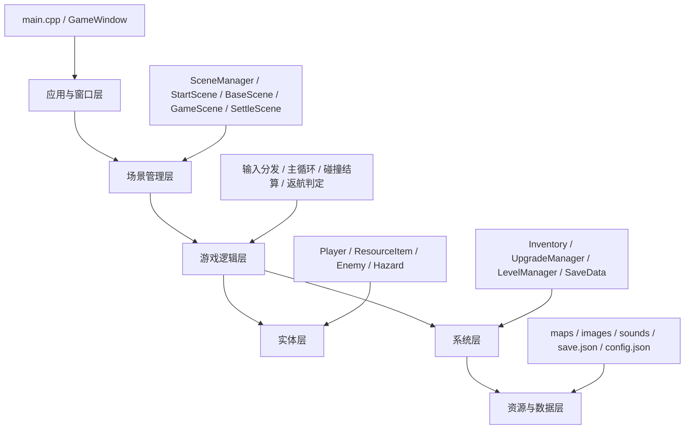
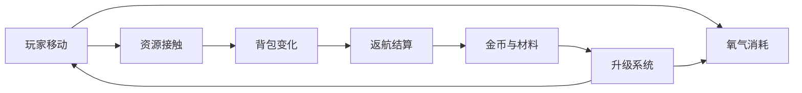
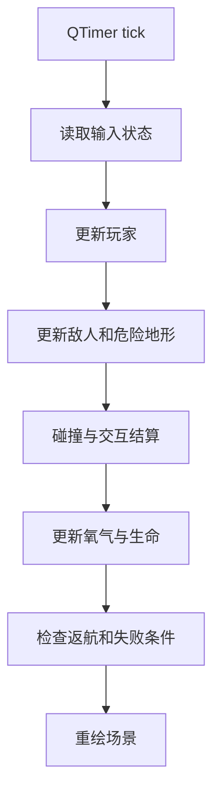

# 架构概览

## 1. 项目整体结构

`深潮回收站` 的推荐架构不是把所有功能直接堆在一个窗口里，而是分成四层：

1. 应用与场景层
2. 游戏逻辑层
3. 实体与数据层
4. 资源与持久化层

这样做的目标是：

- 窗口切换和游戏逻辑解耦
- 玩家、资源、敌人、升级、存档可分别维护
- 后续写实验报告时能清楚讲清楚类职责和数据流

## 2. 分层结构



## 3. 场景结构

建议项目使用以下场景：

### StartScene

职责：

- 显示开始菜单
- 进入新游戏或继续游戏
- 展示操作说明

### BaseScene

职责：

- 作为海面回收站的主界面
- 展示金币、升级、图鉴、海域解锁情况
- 进入出航

### GameScene

职责：

- 主游戏场景
- 处理玩家移动、资源采集、氧气消耗、危险判定和返航逻辑

### SettleScene

职责：

- 展示本次出航结算
- 卖出资源
- 进入升级或再次出航

## 4. 核心类设计

## 4.1 GameWindow

职责：

- 作为应用主窗口
- 承载场景切换
- 统一初始化资源和定时器

## 4.2 SceneManager

职责：

- 创建和切换各个场景
- 在场景之间传递必要状态

## 4.3 GameScene

职责：

- 持有玩家、资源、敌人和危险地形
- 驱动更新循环
- 负责渲染和输入响应

推荐拆分方法：

```cpp
void GameScene::updateGame();
void GameScene::updatePlayer(float dt);
void GameScene::updateEnemies(float dt);
void GameScene::updateOxygen(float dt);
void GameScene::handleCollisions();
void GameScene::handleInteractions();
void GameScene::checkReturnOrFail();
```

## 4.4 Player

职责：

- 保存位置、速度、氧气、生命和当前状态
- 处理移动、冲刺、采集和背包交互

关键字段建议：

```cpp
float x;
float y;
float vx;
float vy;
int hp;
float oxygen;
float maxOxygen;
float speed;
int cargoUsed;
int cargoLimit;
```

## 4.5 ResourceItem

职责：

- 表示地图中的可采集对象
- 保存资源类型、价值、稀有度、碰撞范围和采集时间

## 4.6 Enemy

职责：

- 表示危险生物
- 按状态机执行巡逻、接近、放电、冲撞等行为

## 4.7 Hazard

职责：

- 表示静态或周期性危险地形
- 例如热泉喷口、水流通道、黑暗区

## 4.8 Inventory

职责：

- 保存背包内容
- 判断容量上限
- 统计出航收益和升级材料

## 4.9 UpgradeManager

职责：

- 管理升级等级和效果
- 校验金币和材料是否足够
- 把升级效果作用到玩家和系统参数上

## 4.10 LevelManager

职责：

- 加载地图
- 管理海域解锁状态
- 安排不同海域的资源和危险分布

## 4.11 SaveData

职责：

- 保存金币、升级等级、解锁状态和图鉴
- 提供存档读写接口

## 5. 关键系统关系



这个图表示本项目真正的核心闭环：

- 玩家移动推动探索
- 探索带来氧气消耗和资源接触
- 资源进入背包后触发返航压力
- 返航结算把成果转为金币和材料
- 升级系统改变下一轮的探索能力

## 6. 推荐目录结构

```text
DeepTideStation/
├── assets/
│   ├── images/
│   ├── sounds/
│   ├── fonts/
│   └── maps/
├── docs/
├── src/
│   ├── main.cpp
│   ├── gamewindow.h
│   ├── gamewindow.cpp
│   ├── scenemanager.h
│   ├── scenemanager.cpp
│   ├── startscene.h
│   ├── basescene.h
│   ├── gamescene.h
│   ├── settlescene.h
│   ├── player.h
│   ├── resourceitem.h
│   ├── enemy.h
│   ├── hazard.h
│   ├── inventory.h
│   ├── upgrademanager.h
│   ├── levelmanager.h
│   ├── savedata.h
│   └── utils.h
└── README.md
```

## 7. 推荐数据组织

### 7.1 资源配置

建议把资源参数单独配置，不要全部写死在 `switch` 里。

可以先用简单文本或 JSON：

```json
{
  "glow_cluster": {
    "name": "荧团浮体",
    "value": 15,
    "pickupTime": 0.2,
    "cargo": 1
  }
}
```

### 7.2 地图配置

建议前期使用手工地图，不做复杂随机生成。

地图至少保存：

- 场景尺寸
- 障碍位置
- 资源出生点
- 敌人出生点
- 海面返航区位置

## 8. 主循环设计

推荐使用固定刷新驱动：



### 推荐更新顺序说明

1. 先读取输入，决定本帧意图。
2. 再更新玩家位置。
3. 再更新敌人和环境，保证它们基于最新玩家位置反应。
4. 再做碰撞和交互，统一结算。
5. 最后更新氧气和胜败条件。

## 9. 关键状态设计

玩家建议具备以下状态：

- `Idle`
- `Moving`
- `Collecting`
- `Hit`
- `Returning`
- `Dead`

敌人建议具备以下状态：

- `Patrol`
- `Alert`
- `Attack`
- `Cooldown`

## 10. 架构约束

为了后续不把工程做乱，建议遵守以下约束：

1. 场景切换逻辑不要散落在每个实体里，统一由场景或管理器负责。
2. 升级数值不要直接硬编码在多个类里，统一走 `UpgradeManager`。
3. 存档读写不要直接在渲染函数里调用。
4. 实体绘制和实体数据尽量分开处理。
5. 地图配置和资源配置优先数据驱动，减少重复 `if-else`。

## 11. 当前架构优势

- 主循环清晰，便于调试。
- 模块边界明确，适合面向对象课程要求。
- 后续补第二海域、图鉴和音效不会重写核心结构。
- 实验报告里能直接说明类职责和系统关系。

## 12. 当前架构需要注意的问题

1. 如果一开始把所有逻辑都写进 `GameScene`，后期会很难维护。
2. 如果背包、升级、结算没有独立模块，数值很容易互相污染。
3. 如果资源类型和升级参数全部写死，后续调数值会非常痛苦。
4. 如果场景之间状态交接不清，返航结算和再次出航最容易出 bug。

## 13. 最后结论

本项目最合理的架构不是追求大而全，而是：

1. 用少量场景构成完整流程。
2. 用独立系统构成可维护的核心循环。
3. 用配置和管理器减少重复耦合。

只要保持这三点，项目后续扩展会非常顺。
